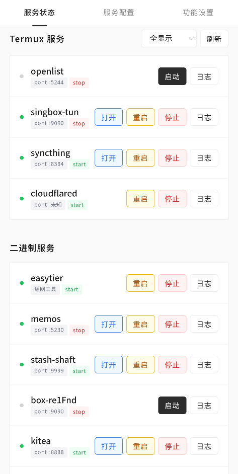
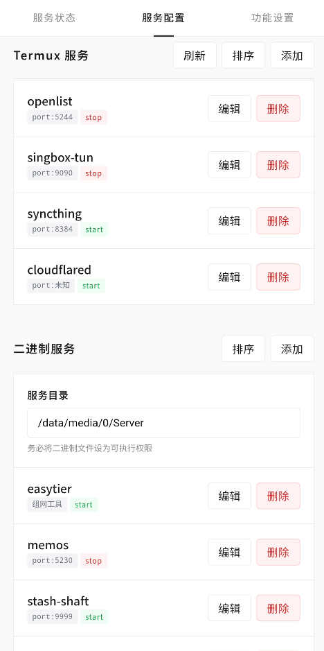
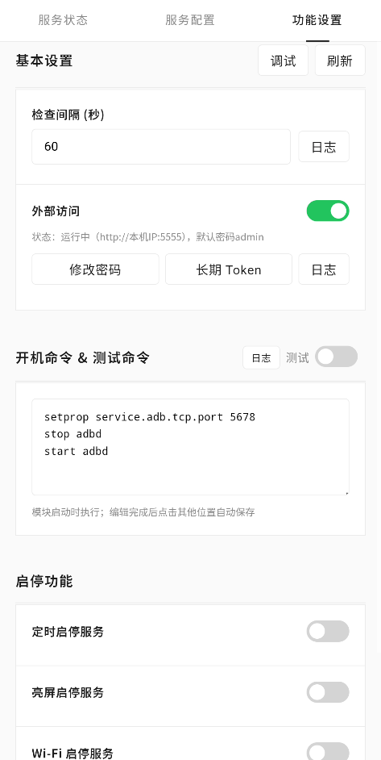
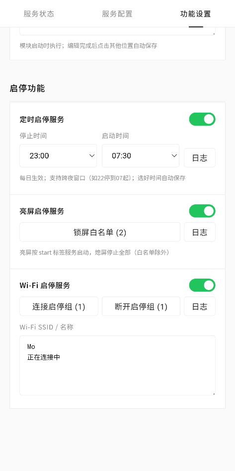
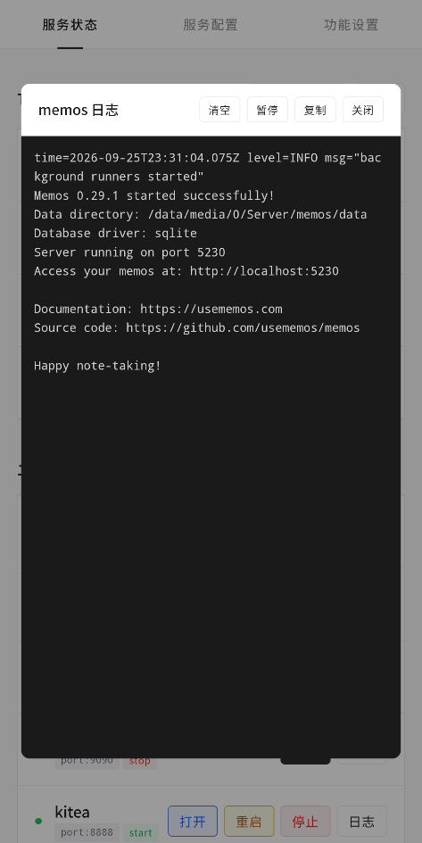
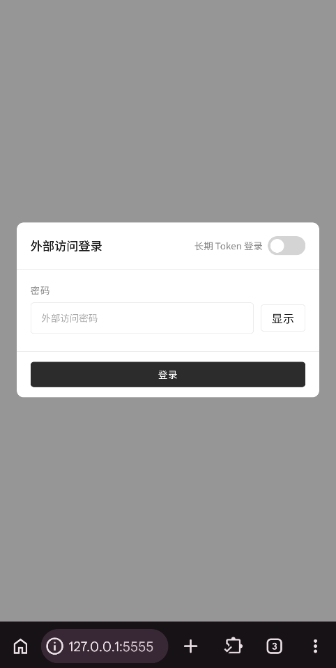

<div align="center">
<h1>SvcHub</h1>
  <p>
    <b>一个 Termux / 二进制服务启动和保活的管理模块，支持WebUI 聚合管理</b>
  </p>
  <p>
    <a href="https://developer.android.com">
      </a>
    <a href="https://www.gnu.org/software/bash/">
      
    </a>
    <a href="https://kernelsu.org">
      
    </a>
    <a href="https://github.com/LimpidMo/SvcHub/blob/master/LICENSE">
      
    </a>
    <a href="https://github.com/LimpidMo/SvcHub/releases">
      
    </a>
    <a href="https://github.com/LimpidMo/SvcHub/releases">
      
    </a>
    <a href="https://github.com/LimpidMo/SvcHub/stargazers">
      
    </a>
  </p>
</div>

## 功能概览
> 初衷就是为了裸核运行一些服务，聚合管理服务
<div align="center">

| 服务状态 | 服务配置 | 功能设置|
|---------|---------|---------|
|  |  ||
| 启停服务 | 服务日志页 | 网页登录页|
|  |  ||
</div>

### 两类服务

| | Termux 服务 | 二进制服务 |
|---|---|---|
| 运行环境 | Termux（以 Termux 用户身份执行） | 系统 root 环境 |
| 工作目录 | `/data/data/com.termux/files/home` | 可配置，默认 `/data/media/0/Server` |
| 附加参数 | 默认无，可设如 `-g 3003` 网络权限，`-u 10123` 指定用户运行仅对用户、权限敏感程序配置使用 | 同上 |
>注：启动 Termux 中的服务不会启动 Termux 后台，无需自启动软件挂后台


### 巡检保活

每隔固定间隔，默认 60 秒执行一次巡检（可配置 10~86400 秒，高于60则分片休眠，以保证配置热更新和功能检查）：
- 开机后自动启动带有 start 绿色标签的服务，即开启“自动启动 & 保活”的服务
- 每次巡检检查 start 标签的服务，
  - 如未启动或已被系统杀死则重新启动服务，
  - 不会杀死已启动的 stop 标签服务，以便满足临时手动启动服务后被误杀
- 更改检查间隔时间后，一分钟内生效，并打断原有间隔，即时生效新间隔。
- 若服务日志超过 1MB 轮转保留最近1/4，保持近期日志上下文的同时避免日志无限增长
- 若启停功能开启，执行启停功能检查

### 启停功能
>**优先级**：功能全开时（但不推荐），定时启停> 亮屏启停> Wi-Fi 启停>普通巡检
- **定时启停服务**：按每日时间窗口服务全停，过时间窗后再恢复正常巡检
  - 停止时间~启动时间：选好自动保存；支持跨夜窗口（如停 22:00、启 07:00，该段时间内为停止窗口）
- **亮屏启停服务**：亮屏解锁后恢复正常巡检，熄屏停止全部（可设锁屏白名单）
  - 检测按10秒分片执行，以便亮屏解锁快速响应，锁屏判断间隔按分片休眠间隔
- **Wi-Fi 启停服务**：打开开关后按所选分组启停，两组的选择的服务互斥
  - **连接组**：连上名单 Wi-Fi 时运行，离开即停止
  - **断开组**：离开名单 Wi-Fi 时运行，连上即停止
  - **SSID**：两组共用，每行一个 Wi-Fi 名称，留空 = 任意 Wi-Fi
  - 该功能更推荐无 start 标签的服务搭配使用

>注：本模块不做WakeLock唤醒锁，应设备而异可能应锁屏 Doze 策略，导致推迟至亮屏才响应该功能恢复巡检，但这一般影响日常使用体验

## WebUI 使用

在 KernelSU 或 Apatch 等管理器 → 模块 →  点击打开 SvcHub → 进入 WebUI。页面可左右滑动查看，
>或开启外部访问（默认开启），访问 http://127.0.0.1:5555，默认密码 admin

## 服务配置示例

### Termux 服务配置
以 OpenList 为例，Termux 服务默认工作目录 `/data/data/com.termux/files/home`：
- 方案1：**在 Termux 怎么启动就怎么填**
  - openlist 则直接填写`openlist server`，跟在 termux 中启动 openlist 相同,
- 方案2：**建目录统一管理（防止服务文件混杂）** 
  - 可自行在该目录下在创建一个 `openlist` 文件夹
  - 如 openlist 放在`/data/data/com.termux/files/home/openlist`，则启动命令填 `cd ./openlist;openlist server`,或`openlist server --data ./openlist/data`
- 端口填写 5244 ,启动后即可打开所对应服务页。
- 若是首次启动 openlist 记得去日志中查看登录密码 passowrd 字段


### 二进制服务配置
以 [Memos](https://github.com/usememos/memos) 为例，二进制服务默认工作目录 `/data/media/0/Server`，即外部存储目录 `/storage/emulated/0/Server`：
- 在`Server` 文件夹加下创建个`memos`文件夹，将下载的`memos_0.xx.0_linux_arm64.tar.gz`解压获得可执行的`memos`放入该文件夹内
- 相关二进制文件已设置可执行权限（`chmod +x ./memos`），本模块不提供对二进制文件权限修改，请自行处理。依赖的库文件和相关资源文件与二进制放在同一目录
- 启动命令填写`cd ./memos;./memos`，前面`cd ./xxx`是切换工作目录进入目录，后面`./xxx`是启动二进制文件
- memos 启动后默认端口 8081 ，也可以加`--port 5230`指定端口 5230 ，其他参数请看官方文档。将8081填入端口输入框中即可在服务页打开跳转

## 本地开发与模块构建


### 本地开发联调

电脑浏览器直接调 WebUI，脚本在固定沙盒 `.mock-sandbox/` 里真实执行，

```powershell
node tools/mock-server.js          # 启动联调桥 → http://127.0.0.1:8090
node tools/mock-server.js stop     # 停桥 + 清理沙盒服务
node tools/mock-server.js reset    # 恢复出厂配置：删沙盒 config/run/log 重建示例
node tools/mock-server.js reflash  # 改脚本后热更新文件
```

- Wi-Fi 模拟：`curl "http://127.0.0.1:8090/__wifi?state=on&ssid=Home"`
- 冷启动可带参数：`node tools/mock-server.js --wifi on --ssid Home`
- shell命令依赖 Git Bash（mock-server 自动探测安装路径，尽量配置系统环境）

### 模块构建

```powershell
python tools/pack.py --check    # 只校验 14 个必需文件齐全 + 脚本 exec 位
python tools/pack.py            # 打正式包 → dist/SvcHub_v<version>.zip
python tools/pack.py --tag dev  # 打测试包 → dist/SvcHub_v<version>_dev.zip
```

- 版本号读 `module.prop` 的 `version` 字段
- 新增模块文件需同步补 `tools/pack.py` 的 `REQUIRED_FILES` 清单

## 安装

1. [Releases](https://github.com/LimpidMo/SvcHub/releases/) 中下载模块 ZIP
2. 在 Root 管理器中 → 模块 → 从本地安装，选择对应 ZIP 文件刷入
3. 安装完成后重启设备，若升级时会自动保留已有配置。

## 注意事项

- 【请自行确认服务以及命令的的安全性，再到放到模块中应用和执行。自行对操作和处理负责】
- Termux 服务依赖已安装的 Termux 应用，下载对应的包，如 openlist 使用 `pkg update & pkg install -y openlist`，
  - 更新服务：在 Termux 使用 `pkg update & pkg upgrade -y` 更新全部或 `pkg update & pkg install -y 服务名1,服务名2` 更新单个或多个。
- 所有脚本为 POSIX sh，兼容 Android `/system/bin/sh`
- 玩机有风险，请自行备份数据，防止数据丢失。代码全公开请自行检阅后按需刷入。

## 许可证

本项目采用 [GNU General Public License v3.0](https://www.gnu.org/licenses/gpl-3.0.html) 许可证。

Copyright (C) 2026 LimpidMo

完整文本请见 [LICENSE](LICENSE) 文件。
